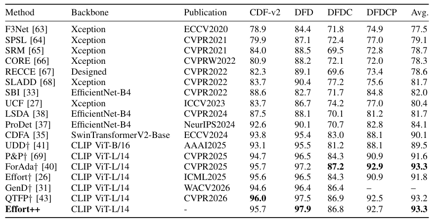
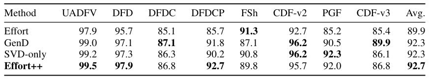

# Effort++

[](https://creativecommons.org/licenses/by-nc/4.0/)   

Official implementation accompanying **Effort++: SVD Residual Adaptation and Hyperspherical Feature Learning for Generalizable Deepfake Detection**.

## Method

Effort++ adapts CLIP ViT-L/14 using SVD residual adaptation and hyperspherical feature learning to improve cross-domain deepfake detection. Please refer to the paper for methodological details.

## Partial Results

The following tables present part of the results of Effort++ on face deepfake detection benchmarks. Results are reported as video-level AUC (%). Please refer to the paper for complete results and experimental details.





## Layout

```text
DeepfakeBench/training/
  config/detector/
    effort_svd_lu_slerp_cos.yaml
    effort_svd_lu_slerp_cos_circle.yaml
    effort.yaml
    gend.yaml
  detectors/
    effort_detector.py
    gend_detector.py
  regularization/
  train.py
  test.py
  demo.py
```

## Setup

Use Python 3.8 on a machine with an NVIDIA driver compatible with CUDA 11.3. The installer installs the versions in `requirements.txt` and downloads OpenAI CLIP ViT-L/14.

```bash
bash install.sh
```

To use a specific Python interpreter:

```bash
PYTHON_BIN=python3.8 bash install.sh
```

To verify the environment after installation:

```bash
python -m pip check
cd DeepfakeBench/training
OMP_NUM_THREADS=1 python test_regularization.py
```

## Data preparation

For datasets available in processed form from [DeepfakeBench](https://github.com/SCLBD/DeepfakeBench#2-download-data) or [DF40](https://github.com/YZY-stack/DF40#3-download-df40-data-after-pre-processing), the experiments directly use the released RGB face frames and JSON manifests; do not preprocess those datasets again. For datasets not provided by either project, obtain the original data and apply the [DeepfakeBench preprocessing pipeline](https://github.com/SCLBD/DeepfakeBench#3-preprocessing) to extract frames, crop faces, and generate matching JSON manifests.

For DF40, follow the upstream repository instructions to obtain both real and fake samples.

The default configuration expects this layout:

```text
DeepfakeBench/
  datasets/rgb/
    FaceForensics++/
    Celeb-DF-v2/
    ...
  preprocessing/dataset_json/
    FaceForensics++.json
    Celeb-DF-v2.json
    ...
```

Place the JSON files supplied by the upstream projects, or generated with the DeepfakeBench preprocessing pipeline, under `preprocessing/dataset_json/`. Manifest filenames must exactly match the dataset names passed on the command line. A dataset used for training, validation, or testing must provide the corresponding `train`, `val`, or `test` split. Frame paths in its `frames` lists are relative to `datasets/rgb/`. To keep data elsewhere, change `dataset_root_rgb` and `dataset_json_folder` in both `training/config/train_config.yaml` and `training/config/test_config.yaml`.

The evaluation scope follows the paper: UADFV, DFD, DFDC, DFDCP, FaceShifter, Celeb-DF-v2, PolyGlotFake, Celeb-DF++, and the DF40 generator subsets.

In commands and JSON filenames, use `DeepFakeDetection` for DFD and `Celeb-DF-v3` for Celeb-DF++.

## Train

Run from `DeepfakeBench/`:

```bash
python training/train.py \
  --detector_path training/config/detector/effort_svd_lu_slerp_cos.yaml \
  --train_dataset FaceForensics++ \
  --validation_dataset Celeb-DF-v2
```

Training uses Adam with learning rate 2e-4, betas (0.9, 0.999), epsilon 1e-8, weight decay 5e-4, and batch size 32. It runs for at most 50 epochs and stops after 10 epochs without validation AUC improvement. The same validation AUC is used to select `ckpt_best.pth`.

Each training run creates an independent timestamped directory under `log_dir`. Its `config.yaml`, `training.log`, checkpoints, metrics, and TensorBoard files are kept together and are not overwritten by later runs.

Use `effort.yaml` for the paper's SVD-only baseline or `effort_svd_lu_slerp_cos_circle.yaml` for the optional Circle variant. `gend.yaml` is a local GenD reimplementation; the paper evaluates the authors' released checkpoint.

## Checkpoints

Download the default Effort++ checkpoint from [Release v1.0.0](https://github.com/ZZBANNINGS/EffortPlusPlus/releases/tag/v1.0.0).

Download from the repository root using an authenticated GitHub CLI:

```bash
gh release download v1.0.0 --repo ZZBANNINGS/EffortPlusPlus \
  --pattern ckpt_best.pth --dir DeepfakeBench/training/weights
```

Checkpoint SHA-256:

```text
1687ca48621e6087bb4c4c2475fc8f02cda6e9a737bae901dbc0432632801c17
```

Use `training/weights/ckpt_best.pth` for `--weights_path` or `--weights` in the commands below when using this download. The CLIP backbone is still required and is downloaded by `install.sh`.

For the training command above, the best checkpoint selected on Celeb-DF-v2 is saved to:

```text
DeepfakeBench/logs/effort_plus_plus/effort_<timestamp>/test/Celeb-DF-v2/ckpt_best.pth
```

In general, the output path is `<log_dir>/<model_name>_<timestamp>/test/<validation_dataset>/ckpt_best.pth`, relative to `DeepfakeBench/`. The exact run directory is printed when training starts. A downloaded checkpoint may be stored anywhere; pass its path through `--weights_path` or `--weights`.

## Evaluate

Run from `DeepfakeBench/`:

```bash
python training/test.py \
  --detector_path training/config/detector/effort_svd_lu_slerp_cos.yaml \
  --test_dataset Celeb-DF-v2 DFDC DFDCP \
  --weights_path training/weights/ckpt_best.pth
```

To evaluate a newly trained checkpoint, replace `training/weights/ckpt_best.pth` with the checkpoint path printed by the training command.

## Inference

Run from `DeepfakeBench/` with an already cropped face image or a directory of cropped face images. This command does not perform face detection or alignment.

```bash
python training/demo.py \
  --detector_config training/config/detector/effort_svd_lu_slerp_cos.yaml \
  --weights training/weights/ckpt_best.pth \
  --image /path/to/cropped-face-or-directory
```

## Citation

```bibtex
@article{zhou2026effortplusplus,
  title={Effort++: SVD Residual Adaptation and Hyperspherical Feature Learning for Generalizable Deepfake Detection},
  author={Zhou, Fuxin},
  year={2026}
}
```

## License

Except where otherwise noted, the use of this code is restricted to the [Creative Commons Attribution-NonCommercial 4.0 International License](https://creativecommons.org/licenses/by-nc/4.0/).

This codebase is adapted from [DeepfakeBench](https://github.com/SCLBD/DeepfakeBench) and remains subject to its original license and attribution requirements.
